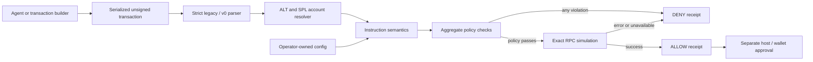

# Architecture

## Security objective

Prevent an autonomous agent from converting a misleading natural-language
description into an unsafe wallet approval. The firewall evaluates the exact
bytes presented for signing against policy that the model cannot modify.

## Runtime pipeline

## Pure core

The code under `src/firewall.rs`, `src/transaction.rs`, `src/programs.rs`, and
`src/rpc.rs` has no WIT, WASI, HTTP, clock, random, filesystem, or process
dependency. Tests drive the same policy path with a deterministic RPC mock.

The parser accepts only canonical transaction wire formats up to Solana's
1,232-byte packet limit. It resolves v0 accounts in Solana's canonical order:
static keys, writable lookup keys, then readonly lookup keys.

## Thin component shim

`src/lib.rs` exports the ZeroClaw `tool-plugin` WIT v0 world. It:

1. decodes the JSON tool call;
2. receives the jailed operator config as `__config`;
3. performs HTTPS JSON-RPC through `waki` and host-mediated `wasi:http`;
4. invokes the pure core; and
5. emits a structured `approve` or `reject` log containing only the receipt
   hash, verdict, and violation count.

## Receipt integrity

`transactionHash` is SHA-256 over complete transaction wire bytes.
`policyHash` is SHA-256 over canonical JSON of the security policy, excluding
the RPC URL so credentials never enter evidence. `receiptHash` covers the
complete receipt with its hash field blank. Repeating the same transaction,
policy, RPC account state, and simulation result produces the same receipt.

## Production replacement points

- Replace one RPC with a quorum adapter and compare account state plus
  simulation results.
- Add Token-2022 extension proofs before allowing any Token-2022 transfer.
- Add stateful daily and rolling limits when the tool-plugin world exposes
  durable storage.
- Feed an `ALLOW` receipt into the ZeroClaw host approval gate or a Squads
  proposal builder. Keep signing outside this component.

