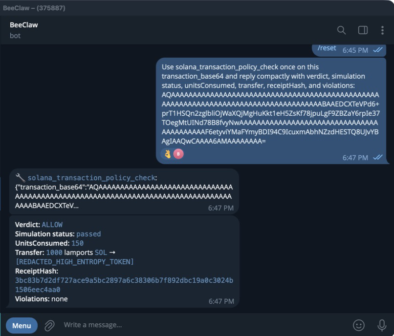

# Solana Policy Firewall

> Prove the transaction bytes before an autonomous agent reaches a wallet.

Solana Policy Firewall is a T0, read-only ZeroClaw WASM plugin that evaluates a
complete unsigned Solana transaction against operator-owned policy and exact
RPC simulation. It returns a deterministic, hash-linked `ALLOW` or `DENY`
receipt. It never receives a private key, signs, or broadcasts.

## The problem

An agent can describe a payment as safe while the serialized transaction does
something else. Natural-language intent is therefore not an approval surface.
A useful agent wallet needs a deterministic boundary between model output and
signing.

## The shipped path

```text
Telegram -> official ZeroClaw -> GPT tool selection -> WASM firewall
  -> strict legacy/v0 parser -> ALT and SPL owner resolution
  -> operator policy -> exact devnet simulation -> ALLOW or DENY receipt
  -> separate wallet or human approval
```

The plugin proves native SOL and classic SPL transfer semantics, resolves v0
address lookup tables, recognizes associated-token-account creation, and
bounds recipients, mints, amounts, signers, writable accounts, compute units,
and priority fees. Unknown programs and ambiguous semantics fail closed.

## Real proof, not a mock

The component was installed into official ZeroClaw commit
`a80ddb64998f81dc5b5b3f80611d0f3e538fab1c` and exercised through its real
Telegram channel against Solana devnet.

The fresh Telegram request returned:

- `ALLOW`, low risk, and no violations;
- devnet simulation passed at 150 compute units;
- one 1,000-lamport SOL transfer;
- transaction hash `7dda935c...a9aad35`;
- policy hash `0226f6f2...82c9bb`; and
- receipt hash `3bc83b7d...ec4aa0`.



The official host also proved two negative paths:

- a forged caller `__config` could not replace operator policy and was denied
  with `recipient_not_allowed`; and
- an expired blockhash returned `BlockhashNotFound` and `DENY`, so stale state
  cannot degrade into approval.

## Safety boundary

| Property | Guarantee |
| --- | --- |
| Custody | T0 read-only |
| Private keys | Never provided |
| Signing | No signing method |
| Submission | No broadcast method |
| Host permissions | `http_client`, `config_read` only |
| Policy ownership | Host-injected, not model-controlled |
| Unknown semantics | Hard denial |
| Evidence | Transaction, policy, and receipt hashes |

An `ALLOW` result is evidence for a later approval step. It is never an
execution.

## Engineering evidence

- 15 deterministic security and behavior tests;
- locked lint and release-build matrix on Rust 1.96.1;
- successful `wasm32-wasip2` component build;
- legacy and v0 message parsing with canonical compact lengths;
- mock-RPC pure core plus a thin ZeroClaw WIT component shim; and
- mergeable upstream contribution to the official registry.

## Why it is useful

This is a reusable safety primitive for agentic payments, treasury operations,
vendor payouts, and any workflow where an LLM prepares Solana transactions.
The model can propose freely while policy remains deterministic and signing
stays outside the model and plugin.

## Judge links

- [Official upstream PR 81](https://github.com/zeroclaw-labs/zeroclaw-plugins/pull/81)
- [Independent public repository](https://github.com/FeeeeelixWong/solana-policy-firewall)
- [Exact official-host evidence](./EVIDENCE.md)
- [Architecture](./ARCHITECTURE.md)
- [Threat model](./THREAT_MODEL.md)

## Next production step

Add RPC quorum comparison, durable approval-state limits, and a fresh-byte
rebuild handshake for expired blockhashes. Keep the current invariant: every
new byte sequence must be checked again, and keys remain outside the plugin.
